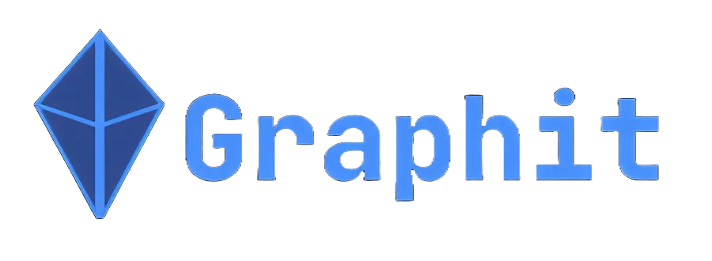

<a id="readme-top"></a>

<!-- PROJECT SHIELDS -->
[![Contributors][contributors-shield]][contributors-url]
[![MIT License][license-shield]][license-url]
[![Issues][issues-shield]][issues-url]

<!-- PROJECT LOGO -->
<br />
<div align="center">
  <a href="https://gitlab.pg.innopolis.university/team20/llm-rosalind">
    
  </a>

  <p align="center">
    <a href="https://gitlab.pg.innopolis.university/team20/llm-rosalind/issues">Report Bug</a>
    ·
    <a href="https://gitlab.pg.innopolis.university/team20/llm-rosalind/issues">Request Feature</a>
  </p>
</div>

<!-- TABLE OF CONTENTS -->
<details>
  <summary>Table of Contents</summary>
  <ol>
    <li>
      <a href="#about-graphit">About Graphit</a>
      <ul>
        <li><a href="#project-demonstration">Demonstration</a></li>
        <li><a href="#user-guide">User Guide</a></li>
        <li><a href="#built-with">Built With</a></li>
      </ul>
    </li>
    <li><a href="#launch-api">Launch API</a></li>
    <li><a href="#launch-frontend">Launch Frontend</a></li>
    <li><a href="#roadmap">Roadmap</a></li>
    <li><a href="#contributing">Contributing</a></li>
    <li><a href="#license">License</a></li>
    <li><a href="#contact">Contact</a></li>
  </ol>
</details>

<!-- ABOUT THE PROJECT -->
## About Graphit


Graphit provides a unique method for creating and studying new courses. This project is integrated within the InnoDataHub ecosystem.

Some features of Graphit:

- Automatic course creation from various sources utilizing LLM
- An intuitive and visually appealing interface
- The possibility to find a variety of courses on different topics
- Different levels of difficulty within the same course

<p align="right"><a href="#readme-top">⬆️</a></p>

___

### Project Demonstration 

To explore Graphit, you can visit [this link](http://10.100.30.244:1001) for personal testing, or alternatively, watch a [demonstration video](http://10.100.30.244:1001).

___

### User Guide

#### Main Page

On the main page of our project, users can access the following features:

* **Popular section** showcasing popular courses
* **Favorite section** displaying favorite courses
* **Search bar** for finding specific courses
* **Add new course** button located next to the search bar (explained <a href="#adding-new-course">later</a> in this guide)

#### Course Card

Each course card includes:

* The course's **name** and **logo**
* The number of **assigned users**
* The **duration** to complete the course
* A **Pin** button to mark courses as favorites

#### Course Description Page

To enroll in a course, users can select any course displayed on the main page or search for a specific one using the search bar.

On the course description page, users can view **detailed information** about the selected course and **register** for it. Additionally, users can pin the course using the designated **pin button**.

#### Course Page

After successfully registering for a course, users can choose topic from **topic tree** or select a required topic from the **topic list**.

Each topic includes **theory** and **tasks** with various answer formats:

* Single choice - only one correct answer
* Multiple choice - one or more correct answers
* Coding task - users write a solution in a designated window

#### Adding New Course

To add a new course, users can select one of the following methods:

* **Manual** - manually create the entire course
* **AI-assisted** - upload a PDF document to a special LLM, which will automatically generate the course after processing the document

___

### Built With

 [![Pytorch][Pytorch]][Pytorch-url]
 
 [![Milvus][Milvus]][Milvus-url]
 
 [![Nougat][Nougat]][Nougat-url]
 
 [![Langchain][Langchain]][Langchain-url]
 
 [![Transformers][Transformers]][Transformers-url]
 
 [![React][React]][React-url]
 
 [![TS][TS]][TS-url]
 
 [![Asyncpg][Asyncpg]][Asyncpg-url]
 
 [![Next][Next.js]][Next-url]
 
 [![FastAPI][FastAPI]][FastAPI-url]

<p align="right"><a href="#readme-top">⬆️</a></p>


## Launch API

Before you begin, ensure you have met the following requirements:

* [Python](https://www.python.org) 3.9 or higher
* [Poetry](https://python-poetry.org/docs/) 1.2.0 or higher

To get started, clone the repository containing the latest version of the API:

```sh
git clone https://gitlab.pg.innopolis.university/team20/llm-rosalind.git -b feature_refactor_backend
```

Configure the environment variables in .env file:

```
# For database
export POSTGRES_DB=<Database name>
export POSTGRES_USER=some=<Database user>
export POSTGRES_PASSWORD=<Database password>
export POSTGRES_HOST=<Database host>
export POSTGRES_PORT=<Database port>

# For API
export API_RUN_HOST=<API host>
export API_RUN_PORT=<API port>
export API_N_WORKERS=<Workers number>

# For static files
export STATIC_FILES_UPLOAD_PATH=<Path to folder with static files>
export STATIC_FILES_DOWNLOAD_PATH=/files/upload

# For ML
export LLM_ENDPOINT=<Outlines serve LLM endpoint>
```

After, to install all required packages, run:

```sh
poetry install
```

Start the API server by executing the following command:

```sh
python3 -m src.backend.api
```

Once the API is running, you can access its documentation and available endpoints at:

`http://<API host>:<API port>/docs`

## Launch frontend

First of all, clone repository with latest version of frontend:

```sh
git clone https://gitlab.pg.innopolis.university/team20/llm-rosalind.git -b feature/main-page
```

Install all necessary dependencies with use of [npm](https://www.npmjs.com) by running:

```sh
npm install
```

To launch frontend in development mode, execute:

```sh
npm run dev
```

With the development server running, you can view the frontend application by navigating to:

http://localhost:3000

<p align="right"><a href="#readme-top">⬆️</a></p>

<!-- ROADMAP -->
# Roadmap

<ul>

<li>
1. Analysis
  <ul>
  <li>🟢 Initial meeting with the customer</li>
  <li>🟢 Collecting requirements</li>
  <li>🟢 Analyzing the problem</li>
  </ul>
</li>  
<li>2. Design 
  <ul>
  <li>🟢 Designing the initial GUI</li>
  <li>🟢 Designing API endpoint design</li>
  <li>🟢 Designing EDR</li>
  <li>🟢 Designing ML pipeline</li>
  </ul>  
</li>
<li>3. MVP-v0 
 <ul>
 <li>🟢 Adjusting GUI to the customer's feedback</li>
 <li>🟢 Implementing the main page</li>
 </ul>
</li>
<li>4. MVP-v1 
 <ul>
 <li>🟢 Adjusting GUI to the customer's feedback</li>
 <li>🟢 Adjusting the main page to the customer's feedback</li>
 <li>🟢 Implementing course preview page</li>
 <li>🟢 Implementing tree view page</li>
 <li>🟢 Implementing theory view page</li>
 </ul>
</li>
<li>5. MVP-v2
 <ul>
 <li>🟢 Implementing task view page</li>
 <li>🟠 Implementing user progress view</li>
 <li>🟠 Implementing course addition view</li>
 <li>🟠 Implementing theory editing view</li>
 <li>🟠 Conducting a comprehensive code review</li>
 </ul>
</li>
<li>6. MVP-v3
 <ul>
 <li>🟠 Integrating with InnoDataHub</li>
 <li>🟠 Implementing tree editing view</li>
 <li>🟠 Implementing task editing view</li>
 </ul>
<li>7. MVP-v4 
 <ul>
 <li>🟠 Assembling AES projects into InnoDataHub</li>
 <li>🟠 Fixing critical bugs</li>
 <li>🟠 Preparing for the demo day</li>
 </ul>
</li>
</ul>

See the [open issues](https://gitlab.pg.innopolis.university/team20/llm-rosalind/-/issues) for a full list of proposed features (and known issues).

<p align="right"><a href="#readme-top">⬆️</a></p>

# Contributing

If you're interested in enhancing this project with new features or improvements, fork the repository and create new branch:

```sh
git checkout -b feature_cool_feature
git commit -m 'Add cool feature'
git push origin feature_cool_feature
```
After completing these steps, you can open a pull request to propose your changes to the main project.

Please adhere to the [GitHub Flow](https://docs.github.com/en/get-started/using-github/github-flow) guidelines in this repository and ensure that branch names comply with the established naming conventions.

<p align="right"><a href="#readme-top">⬆️</a></p>

<!-- LICENSE -->
# License

Distributed under the MIT License. See `LICENSE.md` for more information.

<p align="right"><a href="#readme-top">⬆️</a></p>

<!-- CONTACT -->
# Authors

* Dinislam Gabitov - d.gabitov@innopolis.university
* Egor Chernobrovkin - e.chernobrovkin@innopolis.university
* Marsel Berheev - m.berheev@innopolis.university
* Nikita Stepankov - n.stepankov@innopolis.university
* Nikita Tiurkov - n.tiurkov@innopolis.university
* Oleg Shchendrigin - o.shchendrigin@innopolis.university
* Valeriia Neganova - v.neganova@innopolis.university
* Vladimir Bazilevich - v.bazilevich@innopolis.university
* Andrey Palaev - a.palaev@innopolis.university
* Michail Rudakov - m.rudakov@innopolis.university

<p align="right"><a href="#readme-top">⬆️</a></p>

<!-- MARKDOWN LINKS & IMAGES -->
[product_screenshot]: images/llmrosalind.png
[license-url]: LICENSE.md
[license-shield]: https://img.shields.io/badge/License-MIT-blue?style=flat
[contributors-url]: https://gitlab.pg.innopolis.university/team20/llm-rosalind/-/graphs/feature_refactor_backend?ref_type=heads
[contributors-shield]: https://img.shields.io/badge/Contrbutors-10-green?style=flat&link=https%3A%2F%2Fgitlab.pg.innopolis.university%2Fteam20%2Fllm-rosalind
[issues-shield]: https://img.shields.io/badge/Issues-20-orange?style=flat
[issues-url]: https://gitlab.pg.innopolis.university/team20/llm-rosalind/-/issues
[python]: https://img.shields.io/badge/Python-3.12-blue?style=flat
[python-url]: https://www.youtube.com/watch?v=xvFZjo5PgG0

[Next.js]: https://img.shields.io/badge/Next.JS-%23000000?style=for-the-badge&logo=next.js
[Next-url]: https://nextjs.org/
[Postgres]: https://img.shields.io/badge/PostgreSQL-316192?style=for-the-badge&logo=postgresql&logoColor=white
[Postgres-url]: https://www.postgresql.org
[FastAPI]: https://img.shields.io/badge/FastAPI-%23009688?style=for-the-badge&logo=fastapi&logoColor=%23FFFFFF
[FastAPI-url]: https://fastapi.tiangolo.com
[Age]: https://img.shields.io/badge/Apache_AGE-%236d1fdd?style=for-the-badge&logo=apache
[Age-url]: https://age.apache.org
[Asyncpg]: https://img.shields.io/badge/AsyncPG-%234169E1?style=for-the-badge&logo=postgresql&logoColor=%23FFFFFF
[Asyncpg-url]: https://github.com/MagicStack/asyncpg
[TS]: https://img.shields.io/badge/TypeScript-%233178C6?style=for-the-badge&logo=typescript&logoColor=%23FFFFFF
[TS-url]: https://www.typescriptlang.org
[React]: https://img.shields.io/badge/React-%232361DAFB?style=for-the-badge&logo=react&logoColor=white
[React-url]: https://react.dev
[Transformers]: https://img.shields.io/badge/Transformers-%23FFD21E?style=for-the-badge&logo=huggingface&logoColor=%23000000
[Transformers-url]: https://huggingface.co/docs/transformers/index
[Langchain]: https://img.shields.io/badge/LangChain-%231C3C3C?style=for-the-badge&logo=langchain&logoColor=%23FFFFFF
[Langchain-url]: https://python.langchain.com/v0.2/docs/introduction/
[Nougat]: https://img.shields.io/badge/Nougat-%230467DF?style=for-the-badge&logo=meta&logoColor=%23FFFFFF
[Nougat-url]: https://github.com/facebookresearch/nougat
[Milvus]: https://img.shields.io/badge/Milvus-%2300A1EA?style=for-the-badge&logo=milvus&logoColor=%23FFFFFF
[Milvus-url]: https://milvus.io
[Pytorch]: https://img.shields.io/badge/PyTorch-%23EE4C2C?style=for-the-badge&logo=pytorch&logoColor=%23FFFFFF
[Pytorch-url]: https://pytorch.org
